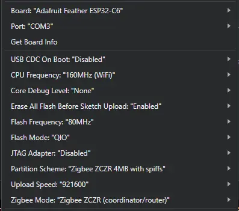

# Zigbee WS2812B LED Strip — XIAO ESP32-C6

A standard Zigbee 3.0 **Color Dimmable Light** for an addressable WS2812B
strip, running on a Seeed XIAO ESP32-C6. Joins the mesh as a **router**, so
it also doubles as a Zigbee range extender.

**Works great with HomeAssistant.**

> [!warn]
> ArduinoZigbee lib does not support animations on comm-layer. If you want animations, use WLED or EspHome.

## Features

- On / Off, brightness, RGB, Hue/Saturation, X/Y, and color temperature (2000–6500 K)
- Smooth non-blocking transitions between states (~400 ms fade, 50 fps)
- Last state restored from NVS on power-up (strip lights up before joining)
- 3 s long-press on BOOT for factory reset (wipes Zigbee + local NVS)
- Joins as a router → extends your Zigbee mesh

## Hardware

| Part            | Notes                                                 |
| --------------- | ----------------------------------------------------- |
| Seeed XIAO ESP32-C6 | Any ESP32-C6 board works; pinout matches XIAO     |
| WS2812B strip   | 90 LEDs (configurable via `NUM_LEDS`)                 |
| 5 V PSU         | Sized for your strip; current cap set to 2 A in code  |

**Wiring**

| XIAO pad | GPIO  | To           |
| -------- | ----- | ------------ |
| D2       | GPIO2 | WS2812B DIN  |
| 5V       | —     | Strip +5 V   |
| GND      | —     | Strip GND    |

Tie the strip's GND to the XIAO's GND. For long strips, inject 5 V at both ends.

## Build & Flash

Requires Arduino IDE or `arduino-cli`, the ESP32 core (≥ 3.x), and FastLED:

```bash
arduino-cli core install esp32:esp32
arduino-cli lib  install FastLED
```

Compile and upload via IDE or use CLI:

```bash
FQBN='esp32:esp32:esp32c6:PartitionScheme=zigbee_zczr,ZigbeeMode=zczr,FlashFreq=80,FlashMode=qio,UploadSpeed=921600'

arduino-cli compile -b "$FQBN" .
arduino-cli upload  -b "$FQBN" -p COM3 .   # adjust port
```

### Arduino IDE settings



- **Board**: Adafruit Feather ESP32-C6
- **USB CDC On Boot**: Disabled
- **CPU Frequency**: 160 MHz (WiFi)
- **Core Debug Level**: None
- **Erase All Flash Before Sketch Upload**: Enabled
- **Flash Frequency**: 80 MHz
- **Flash Mode**: QIO
- **JTAG Adapter**: Disabled
- **Partition Scheme**: Zigbee ZCZR 4MB with spiffs
- **Upload Speed**: 921600
- **Zigbee Mode**: Zigbee ZCZR (coordinator/router)

## Pairing

1. Put your coordinator into permit-join mode.
2. Power on the XIAO. It will join automatically.
3. To re-pair on a different network: hold BOOT for 3 s.

## Configuration

Tweakables at the top of the `.ino`:

```c
#define LED_PIN              2
#define NUM_LEDS             90
#define MAX_MILLIAMPS        2000
#define TRANSITION_MS        400
#define ZB_MANUFACTURER      "Eloquent Systems"
#define ZB_MODEL             "ARGB LED STRIP ESP-32-C6"
```